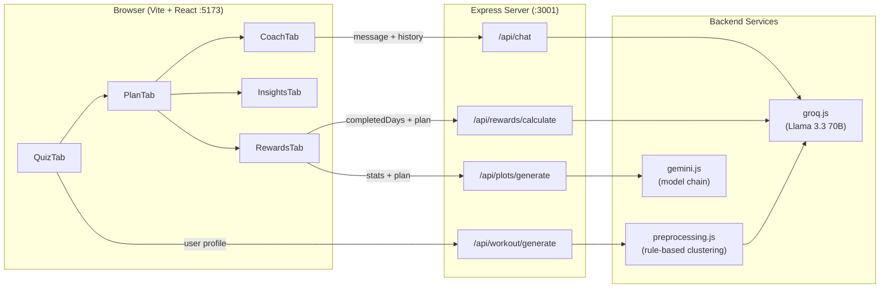
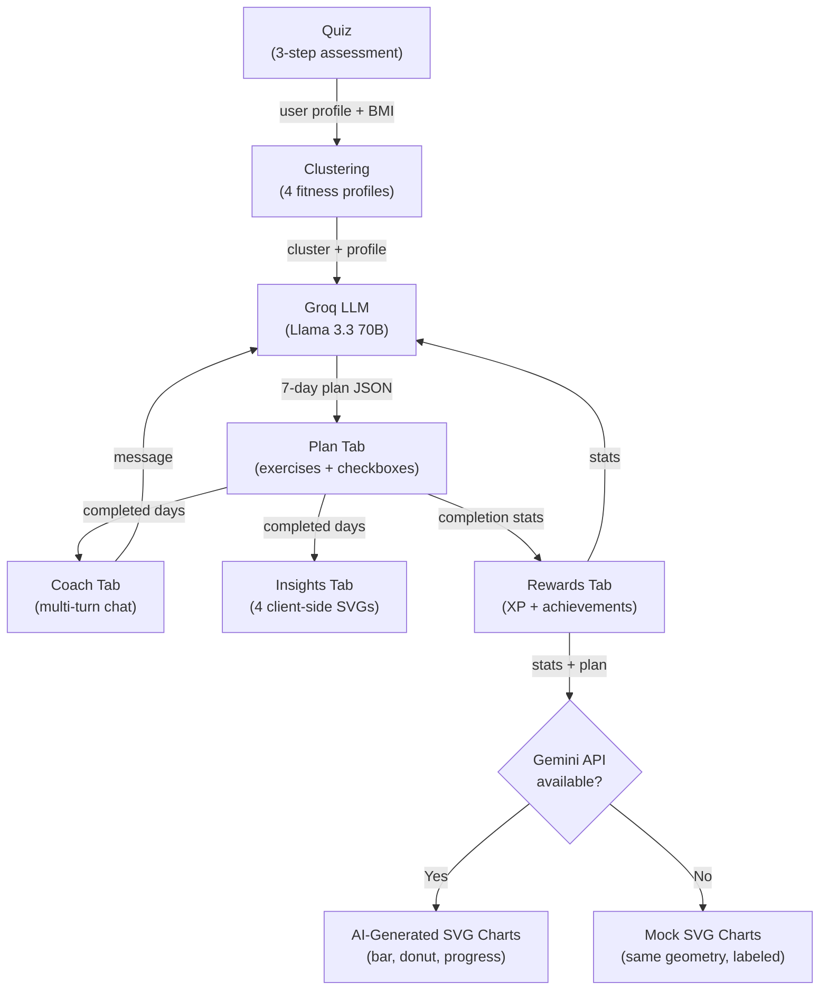
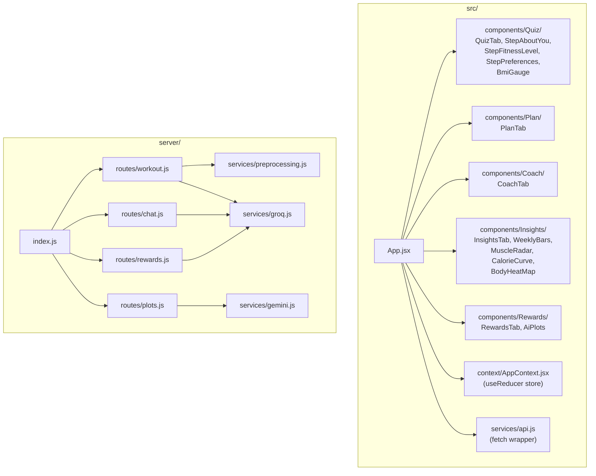

# Smart Workout Recommender

## Setup
#### Option 1 (full features)
1. Clone the repo
2. Create a `.env` file in the root:
```
GROQ_API_KEY=your_key_here
GEMINI_API_KEY=your_key_here
```
3. **Run the app**
```
   npm install && npm run dev
```

 #### Option 2 -- Hosted prototype (LLM features disabled)
[View on Hugging Face Spaces](https://huggingface.co/spaces/MatteoG4444/smart-workout-recommender_prototype)

---

## Project Description

Smart Workout Recommender is a full-stack fitness application that generates personalized weekly workout plans, provides real-time AI coaching, and tracks user progress through gamified rewards. The app collects user data via a guided quiz (body metrics, fitness level, workout preferences), feeds it through a rule-based clustering algorithm to categorize fitness profiles, and then leverages large language models to produce tailored exercise programs and conversational coaching.

The project was originally prototyped in Python (Streamlit + KMeans clustering) and has been fully ported to a JavaScript-only stack for faster iteration and simpler deployment.

## Architecture

### System Overview



### Data Flow



### File Structure



### Frontend

Built with Vite and React (JSX, no TypeScript). State is managed through a single React Context + `useReducer` pattern in `src/context/AppContext.jsx`, which holds user profile data, the generated plan, completion state, and chat history. The UI is organized into five tabs: Quiz, Plan, Coach, Insights, and Rewards. The Insights tab provides four hand-coded SVG visualizations (weekly bar chart, muscle radar, calorie curve, body heatmap) that render client-side without any LLM dependency. The UI renders inside a phone-shaped frame on desktop (500px wide) and switches to full-screen on mobile below 600px. Styling uses custom CSS with a dark gradient theme (purple to pink to warm orange), with no CSS framework dependencies.

### Backend

A lightweight Express server (ESM) running on port 3001. Four route modules handle the core endpoints. The preprocessing service replaces the original Python KMeans model with a deterministic rule-based clustering algorithm that assigns users to one of four fitness profiles (sedentary, light, moderate, athletic) based on activity level, experience, and BMI. This profile is then injected into LLM prompts for personalized output.

### LLM Integration

Two LLM providers serve different purposes:
- **Groq** (Llama 3.3 70B Versatile) handles text generation: workout plans, coaching chat, and reward narratives. The Groq service includes mock fallbacks so the app remains functional without an API key.
- **Google Gemini** generates SVG chart visualizations in the Rewards tab. The service walks a model chain (2.5 Flash -> 2.5 Pro -> 2.0 Flash -> 2.0 Flash Lite), falling through on rate-limit errors. When all models are exhausted, the server returns pre-built mock SVG charts rendered from the same computed geometry, clearly labeled as fallback data.

### Key Design Decisions

- **No database**: all state lives in the browser (React Context). Refreshing the page resets everything. This keeps the prototype lightweight and avoids backend session management.
- **Pre-computed chart geometry**: the plots route calculates exact pixel coordinates for bars, arcs, and progress bars server-side, then asks Gemini only for decorative styling. This produces reliable chart layouts regardless of LLM variability.
- **Mock fallbacks everywhere**: every LLM-dependent feature degrades gracefully. The app is fully usable without any API keys, making it easy to demo and develop offline.
