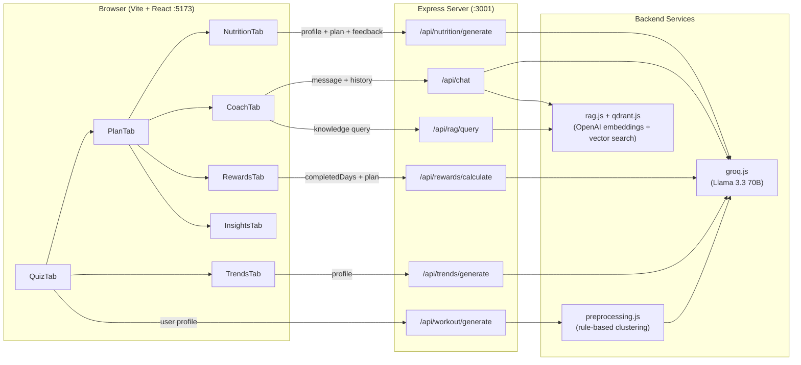
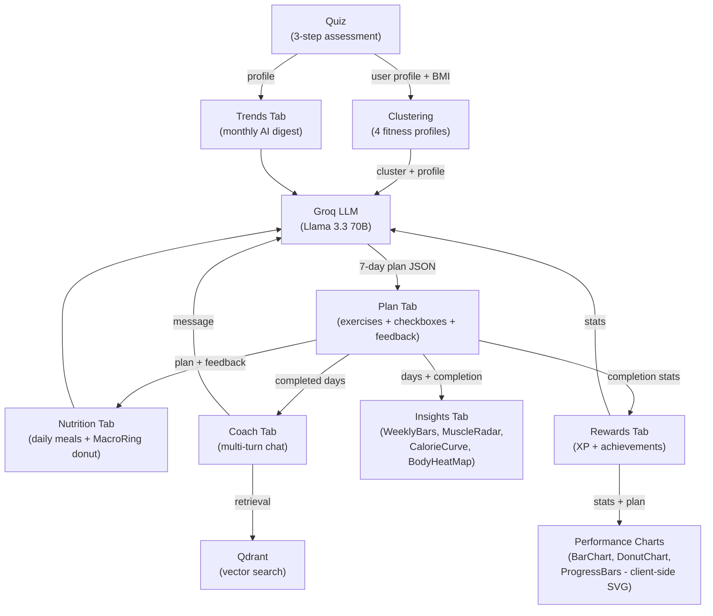
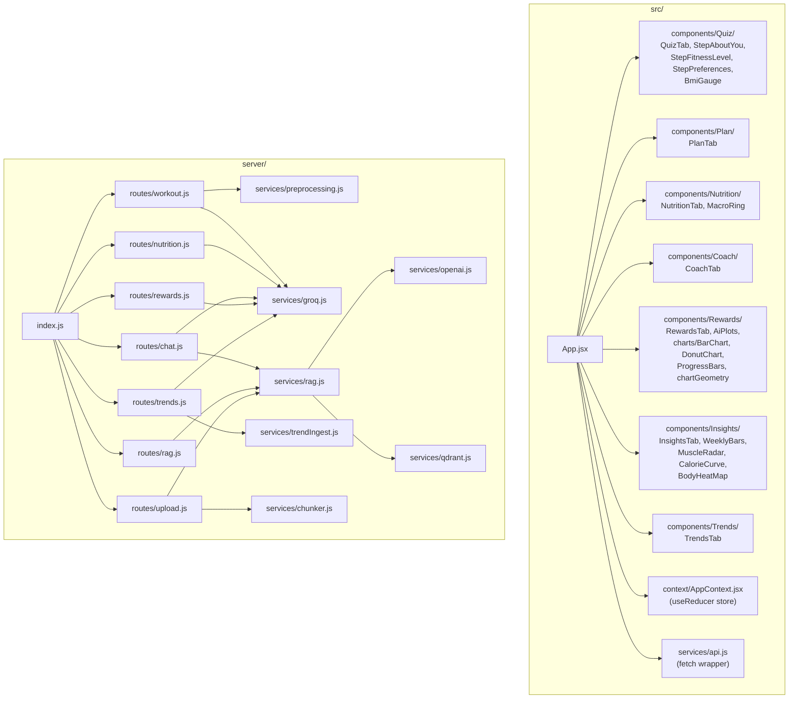

# Smart Workout Recommender

## Setup
#### Option 1 (full features)
1. Clone the repo
2. Create a `.env` file in the root:
```
GROQ_API_KEY=your_key_here
OPENAI_API_KEY=your_key_here
QDRANT_URL=your_qdrant_cluster_url
QDRANT_API_KEY=your_qdrant_api_key
```
3. **Run the app**
```
   npm install && npm run dev
```

 #### Option 2 -- Hosted prototype (LLM features disabled)
[View on Hugging Face Spaces](https://huggingface.co/spaces/MatteoG4444/v3-wtk-recommender)

---

## Project Description

Smart Workout Recommender is a full-stack fitness application that generates personalized weekly workout plans, daily meal plans, monthly fitness trend digests, real-time AI coaching, and gamified progress tracking. The app collects user data via a guided quiz (body metrics, fitness level, workout preferences), feeds it through a rule-based clustering algorithm to categorize fitness profiles, and then leverages large language models to produce tailored exercise programs, nutrition, and conversational coaching. Progress is rendered into hand-coded SVG visualizations across the Insights, Rewards, and Nutrition tabs.

The project was originally prototyped in Python (Streamlit + KMeans clustering) and has been fully ported to a JavaScript-only stack for faster iteration and simpler deployment.

## Architecture

### System Overview



### Data Flow



### File Structure



### Frontend

Built with Vite and React (JSX, no TypeScript). State is managed through a single React Context + `useReducer` pattern in `src/context/AppContext.jsx`, which holds user profile data, the generated plan, completion state, nutrition plan, chat history, per-exercise and per-meal feedback, and the Rewards payload -- all persisted to localStorage so sessions survive reloads. The UI is organized into seven tabs: Quiz, Plan, Nutrition, Coach, Rewards, Insights, and Trends. The UI renders inside a phone-shaped frame on desktop (500px wide) and switches to full-screen on mobile below 600px. Styling uses custom CSS with a dark gradient theme (purple to pink to warm orange), with no CSS framework dependencies.

### Backend

A lightweight Express server (ESM) running on port 3001. Seven route modules (`workout`, `nutrition`, `chat`, `rewards`, `trends`, `rag`, `upload`) handle the core endpoints. The preprocessing service replaces the original Python KMeans model with a deterministic rule-based clustering algorithm that assigns users to one of four fitness profiles (sedentary, light, moderate, athletic) based on activity level, experience, and BMI. This profile is then injected into LLM prompts for personalized output. A `trendIngest` service seeds the monthly Trends digest, and a `chunker` service splits uploaded PDFs before embedding them through the RAG pipeline.

### Visualizations

All charts are hand-coded SVG rendered client-side from pre-computed geometry -- no charting library, no server-side image generation, no LLM variability in the visual layer. There are eight distinct graphs split across three tabs:

**Insights tab** (four charts driven by the generated plan and completion state, plus a three-stat summary strip for workout days, weekly kcal, and categories hit):

- `WeeklyBars` -- seven gradient bars, one per day, sized by exercise count. Completed days switch to a green-to-purple gradient with a soft drop-shadow; rest days render dim with a "rest" label.
- `MuscleRadar` -- six-axis radar (Upper Body, Lower Body, Core, Cardio, Flexibility, Full Body) with four concentric rings. Each day's focus is matched to categories via keyword rules in `InsightsTab.jsx`, with Full Body distributing partial credit across axes.
- `CalorieCurve` -- daily estimated kcal burn across the week, scaled from the cluster's average calorie baseline and the day's exercise count (with diminishing returns past six exercises).
- `BodyHeatMap` -- anatomical outline with muscle regions shaded by normalized category intensity, so the viewer sees at a glance which areas carry the load.

**Rewards tab** (three charts under the "Performance Charts" heading, computed in `charts/chartGeometry.js`, plus the XP progress bar and grade display):

- `BarChart` -- "Weekly Exercise Count" vertical bars with gridlines and value labels, one bar per day.
- `DonutChart` -- "Muscle Group Distribution" pie with center-total, percentages, and a color-keyed legend.
- `ProgressBars` -- "Your Progress" horizontal bars for completion rate, best streak, and related stats.

**Nutrition tab**:

- `MacroRing` -- three concentric arcs (protein, carbs, fat) wrapping the daily calorie target in the center, stacked around a single circle so the ring doubles as a macro-split legend.

### LLM Integration

Two model providers serve different purposes:
- **Groq** (Llama 3.3 70B Versatile) handles text generation: workout plans, daily meal plans, coaching chat, reward narratives, and the monthly fitness trend digest. The Groq service includes mock fallbacks so the app remains functional without an API key.
- **OpenAI** powers the RAG pipeline: `text-embedding-3-large` for embeddings and `gpt-4o-mini` for retrieval-augmented answer synthesis. Vectors are stored in **Qdrant**, a cloud-hosted vector database. Users can upload PDFs (chunked, embedded, and indexed) and the Coach tab silently injects retrieved context into replies.

### Key Design Decisions

- **No database for app state**: user quiz, plan, chat sessions, and rewards all live in the browser (localStorage-backed React Context). Only knowledge vectors persist server-side in Qdrant.
- **Client-side charts**: all Rewards and Insights visualizations are pure JSX SVG built from pre-computed geometry. No server-side image generation, no LLM variability in the visual layer.
- **Mock fallbacks where it matters**: every Groq-dependent feature degrades gracefully when the key is missing, making it easy to demo and develop offline.
